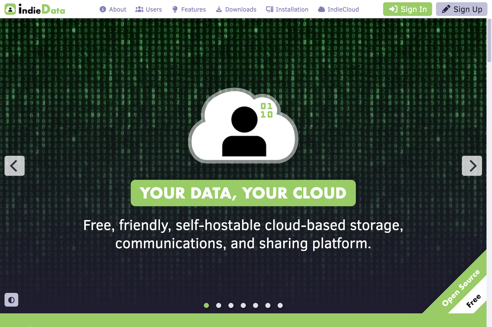

	

# IndieData

IndieData is a cloud-based file storage, management, and sharing system. IndieData makes sharing your data simple. Best of all, you can run it on your own server.

Welcome Screen

Desktop

## Features

- Manage your files - Organize your files into folders.
- Share your files - Share photos by link, shared folder, or email.
- Easy to install - with a one-step Docker installation.
- Easy to use - works like the desktop and mobile systems you already know.
- Customizable - by users and site administrators.
- Platform independent - desktop or mobile.
- Self-hostable - run on your own server.

## Benefits

- Keep your files organized and accessible.
- Easily share your photos with friends, family, or colleagues.
- Set up is quick and painless.
- Spend your time using instead of learning how to use the platform.
- Personalize your IndieData user experience.
- Run on any connected device.
- Take back control over your data from the tech giants.

## Live Demo

You can create an account and explore the features and benefits of the platform at [indiedata.org](https://indiedata.org).

## Installation

Please follow the instructions in [indiedata.org/#installation](https://indiedata.org/#installation) to install the software on your computer or web server.

## Instructions

See the [IndieData User Guide](https://indiedata.org/#help) for instructions on how to use the platform.

## License

Distributed under the <a href="https://en.wikipedia.org/wiki/MIT_License">MIT License</a> which allows unrestricted use of the software. See [LICENSE](LICENSE) for more information.

## Contact

mailto:info@indiecloud.org
